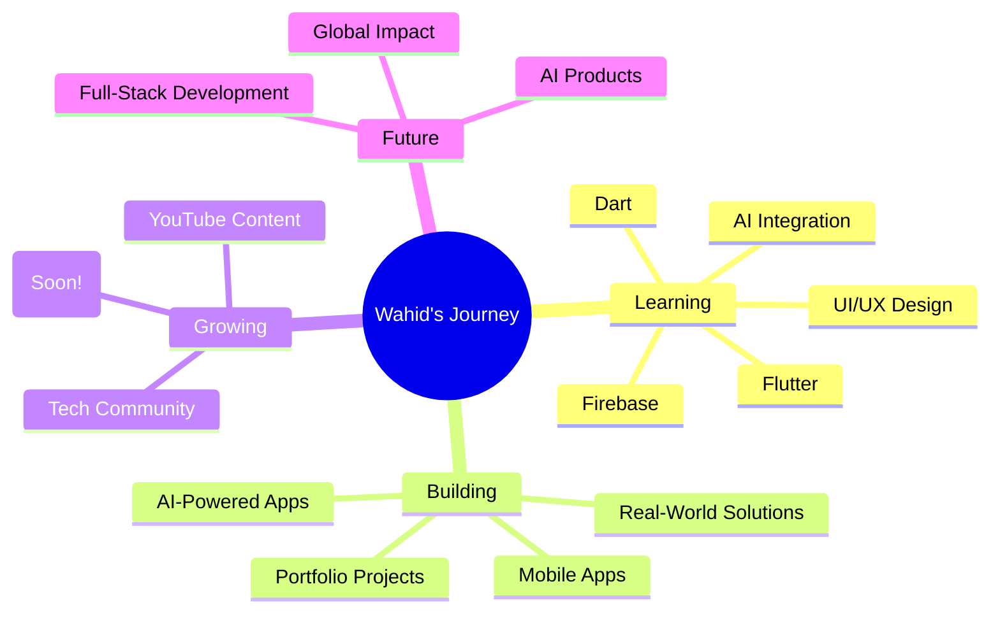

<div align="center">
<!-- Animated Header -->

</div>


<div align="center">

<!--[](url) -->
[](https://linkedin.com/in/mdwahidchowdhury)
[](mailto:w.chowdhury.contact@gmail.com)
[](https://youtube.com/@Wahid_Chowdhury_)


</div>

---

## 🎯 About Me

```typescript
const wahid = {
    location: "Bangladesh",
    education: "B.Sc in Software Engineering- 1st Year @ Noakhali Science and Technology University",
    role: "Mobile Application Developer | Competitive Programmer | Content Creator",
    currentFocus: ["Flutter", "C++", "Building Scalable Apps"],
    passion: ["Creating Digital Experiences", "Capturing Memories", "Long Coding Sessions"],
    openTo: ["Collaborations", "Freelance Projects", "Learning Opportunities"]
};
```


### 🚀 What Drives Me

- 💡Building software that solves real-world problems.
- 📖 Learning something new everyday and improving continously.
- 🧩 Tackling challenging coding and algorithmic problems
- ⭐ Writing clean, efficient, and maintainable code.
- 🤝 Collaborating, sharing knowledge, and growing with the developer community.

<br clear="right"/>


<!--
---

## 🏆 Achievements & Recognition

<table>
<tr>
<td width="50%">

### 🥇 Competition Wins
-
-
-

</td>
<td width="50%">

### 📜 Certifications
-
-
-

</td>
</tr>
<tr>
<td colspan="2">

### 🎓 Events & Community
-
-
</td>
</tr>
</table>

-->

<!--
---

## 💼 Featured Projects

<div align="center">

| Project | Description | Tech Stack | Live Demo |
|---------|-------------|------------|-----------|
|| || |
|| || |
|| || |


</div>

---
-->

---


## 🛠️ Tech Arsenal

<div align="center">


</div>

---

## 📊 GitHub Analytics

<div align="center">
  

<br>


</div>

---

## 🎯 Current Focus



---

## 🤝 Let's Connect & Collaborate!

<div align="center">

I'm always excited to connect with fellow developers, work on interesting projects! 

### 📬 Reach Out

<!--[](url) -->
[](https://linkedin.com/in/mdwahidchowdhury)
[](mailto:w.chowdhury.contact@gmail.com)
[](https://youtube.com/@Wahid_Chowdhury_)

</div>

### 💼 Open For
<div align="center">

Full-Stack Development Projects | Innovative Project Ideas | Open Source Collaboration

---

### 🔥 Great products start with small commits.

**Thanks for visiting! Let's build something amazing together**


</div>


